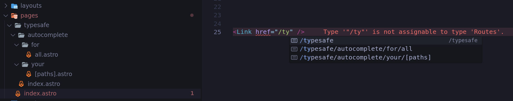

# Typelink

Type-safe autocomplete for all your paths!



✅ Never worry about **typos** in your paths again

✅ Do not waste time **sifting** in your documentation

✅ Support for type-safe **path and query parameters**

✅ **Seamless** integration, **incremental** adoption, scales **with your project**

✅ **ZERO bundle size** option (only <500B uncompressed otherwise!)

> WARNING: It is **very early** in the project, and the API is **not stable** yet. Use at your own risk!

## Features

### Automatic routes discovery (fs routes)

Automatically discover all your routes, and generate a type definition file that you can use in your project. Changes are buffered, and a file is only updated when a change is detected (addition, deletion).

### Dynamic route param typesafety

Using our `Dynamic` helper, you can create fully type-safe dynamic routes. Supports arbitrarily complex routes.

```tsx
<Link href={dyn('/users/[id]', { id: '1' })} /> // ✅
<Link href={dyn('/users/[id]', {})} /> // ❌ Type Error
<Link href={dyn('/users/[id]', { notId: '1' })} /> // ❌ Type Error
<Link
  href={dyn('/articles/[articleId]/snippet/[sectionId]/[paragraphId]', {
    articleId: '1',
    sectionId: '2',
    paragraphId: '3',
  })}
/> // ✅
```

Many frameworks use a special syntax for creating dynamic routes. For example, in Next.js, you can create a dynamic route by denoting a path segment via `[`, `]` eg. `[id]`.

In order to support multiple schemas, we let you define your own schema and provide a couple of defaults for popular formats for you.

> Importing `Dynamic` without `type` modifier opts-out of **zero bundle size** (includes a lightweight url builder weighing in <500B uncompressed)

```ts
// any file
import { Dynamic } from '@typelink/core';

export const dyn = Dynamic.create(Dynamic.square); // when using `[param]` schema
```

> `Dynamic.create` creates a very thin utility that replaces dynamic segments with the provided values. **Typelink will not validate anything**. When passing values to this function, **make sure they are actually the required shape**. We strongly recommend to use a library like [zod](https://zod.dev/) **to validate inputs** before passing values to `dyn`.

```tsx
import { dyn } from './anyFile';
import { Link } from './Link';

// Given an existing `/users/[id]` route
<Link href={dyn('/users/[id]', { id: 'some-id' })} />; // ✅
```

### Manual route declaration, extending existing types

You can manually declare routes by extending existing types. This is useful when you want to add routes that are not automatically discovered (eg. non-fs routes, or external routes).

```ts
// MyRoute.tsx

declare module '#typelink' {
  interface Routes {
    '/my-route': unknown;
  }
}

// ... The rest of your code
```

```ts
// MyOtherRoute.tsx

declare module '#typelink' {
  interface Routes {
    '/my-route/[other]': unknown;
    '/my-route/[other]/[other2]': unknown;
  }
}

// ... The rest of your code
```

> You can also define more than one route at a time! When using this method, TS will also make sure that you don't accidentally redefine a route!

> A common pattern is to create a GIANT file which contains all of your routes. We discourage this pattern even though it is supported. Our recommendation is declare a route (or a modular grouping of routes) in a file that is tied to its definition (kinda like RAII), this way, your route ceases to exist completely when you remove its source.

> If there is no other way for you to do this, we recommend you use the `InferPath` utility to make it easier to define your routes. See the [Utilities](#utilities) section for more information. **Keep in mind this approach scales poorly**.

### Type-safe query params

When declaring routes, you can also declare query params our `Dynamic` helper will now require to provide.

We highly encourage you to use this feature with our `Query` (aliased to `Q` type helper) to make sure we don't accidentally break your code if we ever change the interface we use to handle query params.

```tsx
import { dyn } from './anyFile';
import type { Q } from '@typelink/core';

declare module '#typelink' {
  interface Routes {
    '/my-route': Q<{ param: string; other?: string[] }>;
  }
}
```

```tsx
<Link href={dyn('/my-route', {})} /> // ❌ Type Error
<Link href={dyn('/my-route', { param: '1' })} /> // ✅
<Link href={dyn('/my-route', { param: '1', other: ['2'] })} /> // ✅
<Link href={dyn('/my-route', { param: '1', stuff: "other" })} /> // ❌ Type Error
```

> As you probably noticed, you will need to define these params manually even for automatically discovered routes as there is simply no way for us to know what the query params possibly could be. We are looking into ways to make this type-safe.

> Apart from automatically discovered routes (which you can override **once**), **TS will prevent you from redefining a field** that already exists, so you can code split your routes safely without worrying about breaking your code.

### Utilities

We also have a couple of other utilities that you can use to make defining routes easier.

#### `FromUnion`

It is sometimes useful to declare multiple routes as a union, for this use case we do have a utility type `FromUnion`!

```ts
import type { FromUnion } from '@typelink/core';

declare module '#typelink' {
  interface Routes extends FromUnion<MyRoutes> {}
}
```

#### `InferPath`

An old-schooled way of structuring routes was to nest fields in an object, using `InferPath`, we provide a similar experience.

```ts
import type { InferPath } from '@typelink/core';

type MyRoutes = InferPath<{
  users: {
    '[userId]': {};
  };
  articles: {
    '[articleId]': {
      snippet: {
        '[sectionId]': {
          '[paragraphId]': {};
        };
      };
    };
  };
}>;
```

```ts
declare module '#typelink' {
  interface Routes extends FromUnion<MyRoutes> {}
}
```

Doing this will generate a union of all the routes defined in the object. You can then use `FromUnion` to add them to your `Routes` type. This is useful when you want to define a lot of routes in a single file. We recommend you use this pattern sparingly (or not at all).

> This definition does not support query params. If you need query params, you can however still use the [above pattern](#type-safe-query-params) utilizing `Q`. This can however lead to accidental redefinition and potential for dead code down the line.

#### OptionalHash (advanced)

More an internal util than anything alse, but might be useful when customizing the library beyond defaults. This utility allows you to make a optional `#{content}` segment behind any string in a type-safe manner. Your paths are processed through this utility before given to you when using `Href`.

## Quick Start

### Astro

#### Install the core package and the Astro adapter

```sh
# pnpm
pnpm add @typelink/core
pnpm add -D @typelink/adapter-astro
```

```sh
# yarn
yarn add @typelink/core
yarn add -D @typelink/adapter-astro
```

```sh
# npm
npm install @typelink/core
npm install -D @typelink/adapter-astro
```

#### Add the adapter to your Astro config

```js
// astro.config.mjs

import t from '@typelink/adapter-astro';

export default defineConfig({
  //   ...
  integrations: [other(), integrations(), /* + */ t.astro()],
  //   ...
});
```

#### Add the type reference to your `env.d.ts` file

```ts
// env.d.ts

/// <reference types="../.typelink/routes.d.ts" />
```

Now, a package `#typelink` should be available in your project. This package exposes a type `Routes` that contains all the routes defined in your project.

#### (**Recommended**) Create your own `<Link>` using the new definitions

```astro
// components/Link.astro

---
import type { Href } from "#typelink";

type Props = Omit<astroHTML.JSX.AnchorHTMLAttributes, "href"> & {
  href: Href;
};
const props = Astro.props;
---

<a {...props}>
  <slot />
</a>
```

### Standalone (FS routes)

#### Install the core package and the watcher

```sh
# pnpm
pnpm add @typelink/core
pnpm add -D @typelink/watcher
```

```sh
# yarn
yarn add @typelink/core
yarn add -D @typelink/watcher
```

```sh
# npm
npm install @typelink/core
npm install -D @typelink/watcher
```

#### Run the watcher, ideally in a config file if possible

```js
//  config.js

import t from '@typelink/watcher';

t.watcher({
  // Add a glob to match which files should be considered routes
  glob: '**/!(_)*.tsx', // ex. All .tsx files that do not start with an underscore

  // Add a path to the folder where your pages are located
  path: 'src/pages/', // Don't forget the trailing slash!
});
```

#### Include `typelink` in your `tsconfig.json`

```json
{
  // ...
  "include": ["other", "stuff", /* + */ ".typelink/*.ts"]
  // ...
}
```

#### (**Recommended**) Create your own `<Link>` using the new definitions using your framework of choice

`Next.js` example:

```tsx
// components/Link.tsx

import NextLink from 'next/link';
import type { ComponentProps } from 'react';
import type { Href } from '#typelink';

type LinkProps = Omit<ComponentProps<typeof NextLink>, 'href'> & {
  href: Href;
};

export const Link = NextLink as React.ForwardRefExoticComponent<LinkProps>;
```

## Upcoming features

- 🚧 Tighter framework integration (include components, router methods etc.)
- 🚧 Warn on conflicting parameters (path/query)
- 🚧 First-class validation support

## Limitations

### @typelink/watcher

Library internally uses [`chokidar`](https://github.com/paulmillr/chokidar) to watch for fs events. You can override this dependency yourself by providing a `getWatcher` method when creating a `t.watcher()` via `@typelink/watcher`.

At this point, we are requiring a [`FSWatcher`](https://github.com/paulmillr/chokidar/blob/08318d62f1fa731122d2b8853400f1b3252db8c9/types/index.d.ts#L9C14-L9C23) compatible watcher, but are looking into ways to use an adapter here.

### @typelink/core

When declaring dynamic paths, it is possible to use the TS `string` type in a way similar to `/users/{string}` to denote dynamic segments. This would not require any runtime utility and would thus make the library **truly zero-bundle**. However, this fails when using multiple dynamic segments or really when there is any segment following the dynamic part, as `string` will consume **any string** including the separators which follow. Due to current TS limitations, it is unfortunately not possible to set subtract from `string`, which would make this approach viable.

> However, we actually use this system to make our type-system accept url hashes. As there is always only at most a single hash!

## Contributing

TODO:
